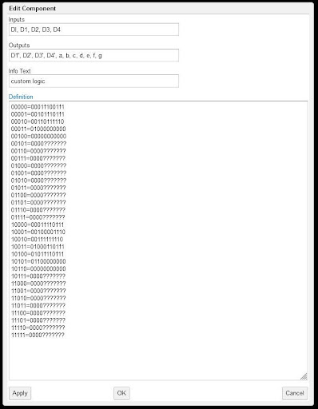
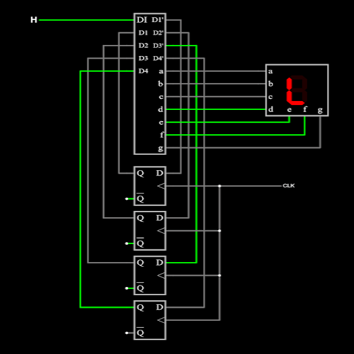

# Scrolling Door Sign (Falstad/EDA Playground)

A finite state machine was designed for a scrolling door sign that displayed 'ALOHA' when an office is open, and 'PAU' when it is closed with custom logic.

## State Diagram

## 'ALOHA' and 'PAU' Truth Table

| In  | Current State |     |     |     | Previous State |     |     |     | Output |     |     |     |     |     |     |     |
| :-: | :-----------: | :-: | :-: | :-: | :------------: | :-: | :-: | :-: | :----: | :-: | :-: | :-: | :-: | :-: | :-: | :-: |
| DI  |      D1       | D2  | D3  | D4  |       D1       | D2  | D3  | D4  |   a    |  b  |  c  |  d  |  e  |  f  |  g  |     |
|  0  |       0       |  0  |  0  |  0  |       0        |  0  |  0  |  1  |   1    |  1  |  0  |  0  |  1  |  1  |  1  |  P  |
|  0  |       0       |  0  |  0  |  1  |       0        |  0  |  1  |  0  |   1    |  1  |  1  |  0  |  1  |  1  |  1  |  A  |
|  0  |       0       |  0  |  1  |  0  |       0        |  0  |  1  |  1  |   0    |  1  |  1  |  1  |  1  |  1  |  0  |  U  |
|  0  |       0       |  0  |  1  |  1  |       0        |  1  |  0  |  0  |   0    |  0  |  0  |  0  |  0  |  0  |  0  | ‘ ‘ |
|  0  |       0       |  1  |  0  |  0  |       0        |  0  |  0  |  0  |   0    |  0  |  0  |  0  |  0  |  0  |  0  | ‘ ‘ |
|  0  |       0       |  1  |  0  |  1  |       0        |  0  |  0  |  0  |   X    |  X  |  X  |  X  |  X  |  X  |  X  |  X  |
|  0  |       0       |  1  |  1  |  0  |       0        |  0  |  0  |  0  |   X    |  X  |  X  |  X  |  X  |  X  |  X  |  X  |
|  0  |       0       |  1  |  1  |  1  |       0        |  0  |  0  |  0  |   X    |  X  |  X  |  X  |  X  |  X  |  X  |  X  |
|  0  |       1       |  0  |  0  |  0  |       0        |  0  |  0  |  0  |   X    |  X  |  X  |  X  |  X  |  X  |  X  |  X  |
|  0  |       1       |  0  |  0  |  1  |       0        |  0  |  0  |  0  |   X    |  X  |  X  |  X  |  X  |  X  |  X  |  X  |
|  0  |       1       |  0  |  1  |  0  |       0        |  0  |  0  |  0  |   X    |  X  |  X  |  X  |  X  |  X  |  X  |  X  |
|  0  |       1       |  0  |  1  |  1  |       0        |  0  |  0  |  0  |   X    |  X  |  X  |  X  |  X  |  X  |  X  |  X  |
|  0  |       1       |  1  |  0  |  0  |       0        |  0  |  0  |  0  |   X    |  X  |  X  |  X  |  X  |  X  |  X  |  X  |
|  0  |       1       |  1  |  0  |  1  |       0        |  0  |  0  |  0  |   X    |  X  |  X  |  X  |  X  |  X  |  X  |  X  |
|  0  |       1       |  1  |  1  |  0  |       0        |  0  |  0  |  0  |   X    |  X  |  X  |  X  |  X  |  X  |  X  |  X  |
|  0  |       1       |  1  |  1  |  1  |       0        |  0  |  0  |  0  |   X    |  X  |  X  |  X  |  X  |  X  |  X  |  X  |
|  1  |       0       |  0  |  0  |  0  |       0        |  0  |  0  |  1  |   1    |  1  |  1  |  0  |  1  |  1  |  1  |  A  |
|  1  |       0       |  0  |  0  |  1  |       0        |  0  |  1  |  0  |   0    |  0  |  0  |  1  |  1  |  1  |  0  |  L  |
|  1  |       0       |  0  |  1  |  0  |       0        |  0  |  1  |  1  |   1    |  1  |  1  |  1  |  1  |  1  |  0  |  O  |
|  1  |       0       |  0  |  1  |  1  |       0        |  1  |  0  |  0  |   0    |  1  |  1  |  0  |  1  |  1  |  1  |  H  |
|  1  |       0       |  1  |  0  |  0  |       0        |  1  |  0  |  1  |   1    |  1  |  1  |  0  |  1  |  1  |  1  |  A  |
|  1  |       0       |  1  |  0  |  1  |       0        |  1  |  1  |  0  |   0    |  0  |  0  |  0  |  0  |  0  |  0  | ‘ ‘ |
|  1  |       0       |  1  |  1  |  0  |       0        |  0  |  0  |  0  |   0    |  0  |  0  |  0  |  0  |  0  |  0  | ‘ ‘ |
|  1  |       0       |  1  |  1  |  1  |       0        |  0  |  0  |  0  |   X    |  X  |  X  |  X  |  X  |  X  |  X  |  X  |
|  1  |       1       |  0  |  0  |  0  |       0        |  0  |  0  |  0  |   X    |  X  |  X  |  X  |  X  |  X  |  X  |  X  |
|  1  |       1       |  0  |  0  |  1  |       0        |  0  |  0  |  0  |   X    |  X  |  X  |  X  |  X  |  X  |  X  |  X  |
|  1  |       1       |  0  |  1  |  0  |       0        |  0  |  0  |  0  |   X    |  X  |  X  |  X  |  X  |  X  |  X  |  X  |
|  1  |       1       |  0  |  1  |  1  |       0        |  0  |  0  |  0  |   X    |  X  |  X  |  X  |  X  |  X  |  X  |  X  |
|  1  |       1       |  1  |  0  |  0  |       0        |  0  |  0  |  0  |   X    |  X  |  X  |  X  |  X  |  X  |  X  |  X  |
|  1  |       1       |  1  |  0  |  1  |       0        |  0  |  0  |  0  |   X    |  X  |  X  |  X  |  X  |  X  |  X  |  X  |
|  1  |       1       |  1  |  1  |  0  |       0        |  0  |  0  |  0  |   X    |  X  |  X  |  X  |  X  |  X  |  X  |  X  |
|  1  |       1       |  1  |  1  |  1  |       0        |  0  |  0  |  0  |   X    |  X  |  X  |  X  |  X  |  X  |  X  |  X  |

## Custom Logic Used in Falstad

## 4-Bit Counter Truth Table

| Q1  | Q2  | Q3  | Q4  | Q1  | Q2  | Q3  | Q4  | D1  | D2  | D3  | D4  |
| :-: | :-: | :-: | :-: | :-: | :-: | :-: | :-: | :-: | :-: | :-: | :-: |
|  0  |  0  |  0  |  0  |  0  |  0  |  0  |  1  |  0  |  0  |  0  |  1  |
|  0  |  0  |  0  |  1  |  0  |  0  |  1  |  0  |  0  |  0  |  1  |  0  |
|  0  |  0  |  1  |  0  |  0  |  0  |  1  |  1  |  0  |  0  |  1  |  1  |
|  0  |  0  |  1  |  1  |  0  |  1  |  0  |  0  |  0  |  1  |  0  |  0  |
|  0  |  1  |  0  |  0  |  0  |  1  |  0  |  1  |  0  |  1  |  0  |  1  |
|  0  |  1  |  0  |  1  |  0  |  1  |  1  |  0  |  0  |  1  |  1  |  0  |
|  0  |  1  |  1  |  0  |  0  |  1  |  1  |  1  |  0  |  1  |  1  |  1  |
|  0  |  1  |  1  |  1  |  1  |  0  |  0  |  0  |  1  |  0  |  0  |  0  |
|  1  |  0  |  0  |  0  |  1  |  0  |  0  |  1  |  1  |  0  |  0  |  1  |
|  1  |  0  |  0  |  1  |  1  |  0  |  1  |  0  |  1  |  0  |  1  |  0  |
|  1  |  0  |  1  |  0  |  1  |  0  |  1  |  1  |  1  |  0  |  1  |  1  |
|  1  |  0  |  1  |  1  |  1  |  1  |  0  |  0  |  1  |  1  |  0  |  0  |
|  1  |  1  |  0  |  0  |  1  |  1  |  0  |  1  |  1  |  1  |  0  |  1  |
|  1  |  1  |  0  |  1  |  1  |  1  |  1  |  0  |  1  |  1  |  1  |  0  |
|  1  |  1  |  1  |  0  |  1  |  1  |  1  |  1  |  1  |  1  |  1  |  1  |
|  1  |  1  |  1  |  1  |  0  |  0  |  0  |  0  |  0  |  0  |  0  |  0  |

## FSM Design

## SystemVerilog

A behavioral model was implement in SystemVerilog using EDA Playground, and attached as a `.sv` file.
